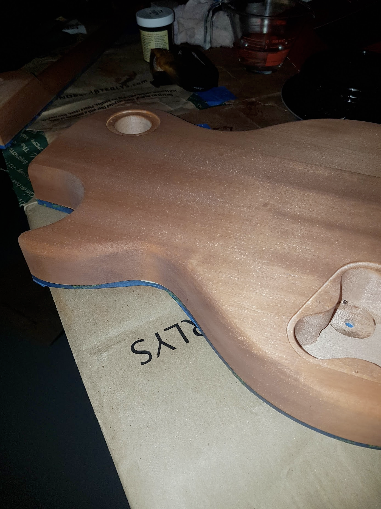

# Day 1

- will require sanding down of binding on high side of neck near joint. Binding is fair bit higher than body here

# Day 3

- first batch of order stuff came

- sanded down some of the binding. Much smoother to veneer height but one gauge made in it with my xacto knife. Oh well!

- scale length measurement

# Day 4

- cut headstock 'design' by lopping off an end and sanding it down

- Other order things arrived.

# Day 5

- Taped off the maple veneer and the fretboard completely

- Tested some of the mahogany stain on scrap wood
- sanded 220 grit and applied two coats to the back and neck

**NOTE**: My makeshift gloves for staining just kinda soaked through. Skip em and use a sandwich bag if need be.

- After drying. Went with a ebony grain filler that was slightly diluted with warm water. Dried overnight

# Day 6

- Sanding 220 grit for quite a while. Aimed to get back to close to bare mahogany with filled grain in the dark contrast.

- This took quite a while. The flat back wasn't too bad to get somewhat uniform. However, the sides and curves were not great.

- Added two more coats of mahogany stain

- color darkening up nicely.

# Day 7

- did more sanding on the sides to try and bring down some areas that still had excess ebony filler. This kinda works, but then you quickly go through the previous stain. So this back and forth happens

